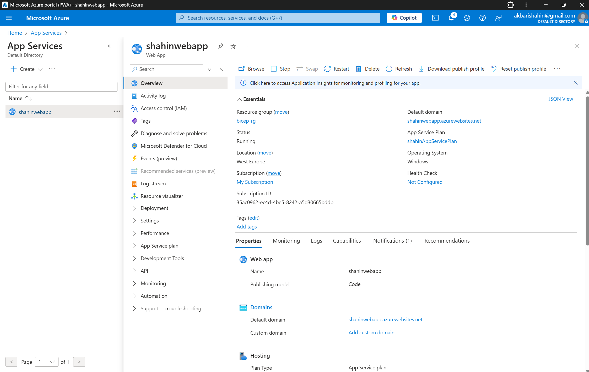
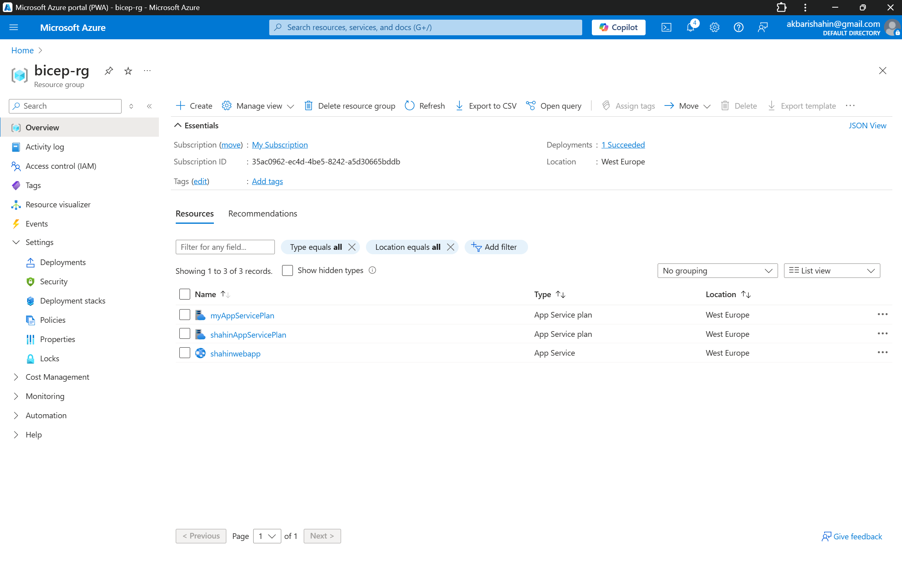

# Azure Web App Deployment using Bicep

This project deploys a simple App Service (Web App) in Azure using Bicep.

## 🧱 Technologies

- Azure Bicep
- App Service (F1 - Free Tier)
- Resource Group
- Azure CLI

## 🚀 How to Deploy

```bash
az group create --name bicep-rg --location westeurope
az deployment group create --resource-group bicep-rg --template-file main.bicep

## 🖼️ Screenshots

### Web App in Azure Portal


### Resource Group


### Deployment Output


